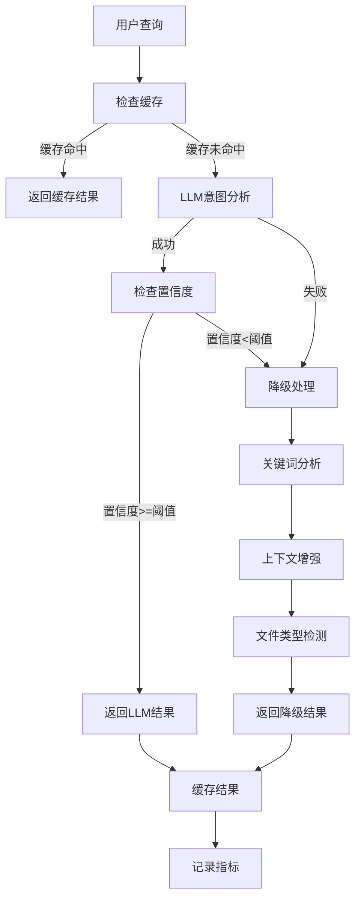

# 意图识别系统 v2.0 重构说明

## 概述

本次重构完全重新设计了项目的意图识别功能，采用**LLM主要分析 + 关键词降级分析**的双层架构，提供更可靠、更灵活的意图识别能力。

## 🎯 重构目标

✅ **不改变现有接口的入参和返参**，只调整内部逻辑  
✅ **支持多种LLM提供商**（DeepSeek/豆包/智谱AI等）  
✅ **智能降级处理机制**，确保服务可用性  
✅ **统一配置管理**，便于运维和扩展  
✅ **完全替换旧实现**，无兼容包袱  

## 🏗️ 新架构设计

### 1. 核心组件

```
意图识别系统 v2.0
├── 配置层 (intent_config.yaml)
│   ├── LLM提供商配置
│   ├── 意图识别提示词
│   ├── 降级处理配置  
│   └── 关键词分析配置
├── 服务层 (IntentRecognitionService)
│   ├── LLM主要分析
│   ├── 关键词降级分析
│   ├── 结果缓存
│   └── 错误处理
└── 接口层 (analyze_user_intent)
    └── 兼容原有接口
```

### 2. 处理流程



## 📋 配置文件说明

### 核心配置 (intent_config.yaml)

```yaml
# LLM配置
llm_config:
  service_mode: "remote"  # remote | local
  current_provider: "deepseek"  # deepseek | doubao | zhipu
  current_model: "deepseek-chat"
  providers:
    deepseek:
      enabled: true
      api_key_env: "DEEPSEEK_API_KEY"
      base_url: "https://api.deepseek.com"
      models: ["deepseek-chat", "deepseek-v3"]
    doubao:
      enabled: true  
      api_key_env: "DOUBAO_API_KEY"
      base_url: "https://ark.cn-beijing.volces.com"
      models: ["doubao-pro-4k", "doubao-lite-4k"]

# 意图识别提示词
intent_prompts:
  system_prompt: |
    你是一个专业的用户意图识别专家...
  user_prompt_template: |
    请分析以下用户输入的意图：
    用户输入："{query}"
  confidence_threshold: 0.6

# 降级处理配置
fallback_config:
  enabled: true
  strategy: "keyword_analysis"  # keyword_analysis | fixed_response | hybrid
  default_intent: "knowledge_search"
  
# 关键词分析配置
keyword_analysis:
  enabled: true
  weights:
    exact_match: 1.0
    partial_match: 0.7
  intent_keywords:
    normal_chat:
      primary: [["什么是", "如何", "为什么"]]
      confidence_base: 0.7
    knowledge_search:
      primary: [["查找", "搜索", "分析"]]
      confidence_base: 0.8
    mcp_action:
      primary: [["创建", "新建", "建立"]]
      confidence_base: 0.9
```

## 🔧 主要功能特性

### 1. 多LLM提供商支持

- **DeepSeek**: 高性价比，推理能力强
- **豆包**: 字节跳动，中文理解优秀  
- **智谱AI**: GLM系列，代码生成能力强
- **OpenAI**: GPT系列（备用）
- **Ollama**: 本地部署选项

### 2. 智能降级机制

| 触发条件 | 降级策略 | 描述 |
|---------|---------|------|
| LLM API失败 | 关键词分析 | 网络问题或服务不可用 |
| JSON解析失败 | 关键词分析 | LLM返回格式错误 |
| 置信度过低 | 关键词分析 | 意图识别不确定 |
| 请求超时 | 关键词分析 | 响应时间过长 |

### 3. 关键词分析增强

- **多层关键词匹配**: 主要关键词 + 次要关键词
- **上下文规则**: 基于正则表达式的上下文增强
- **文件类型检测**: 自动识别文件扩展名
- **权重配置**: 灵活的匹配权重设置

### 4. 结果缓存优化

- **内存缓存**: 快速响应重复查询
- **TTL机制**: 可配置的缓存过期时间
- **LRU淘汰**: 自动管理缓存容量

## 🚀 使用方法

### 1. 基本使用

```python
from app.services.llm_service import LLMService

# 分析用户意图（接口保持不变）
result = LLMService.analyze_user_intent("创建一个新文件")

print(result)
# {
#   "intent_type": "mcp_action",
#   "confidence": 0.9,
#   "action_type": "create_file", 
#   "parameters": {"file_name": null},
#   "reasoning": "检测到创建和文件关键词",
#   "analysis_method": "llm",  # 新增字段
#   "model_used": "deepseek:deepseek-chat",
#   "timestamp": "2024-01-01T12:00:00"
# }
```

### 2. 配置环境变量

```bash
# DeepSeek配置
export DEEPSEEK_API_KEY="your_deepseek_api_key"

# 豆包配置  
export DOUBAO_API_KEY="your_doubao_api_key"

# 智谱AI配置
export ZHIPU_API_KEY="your_zhipu_api_key"
```

### 3. 运行测试

```bash
python test_intent_recognition.py
```

## 📊 性能监控

### 1. 分析指标

- **响应时间**: LLM调用和总处理时间
- **置信度分布**: 意图识别的准确性评估
- **降级率**: 系统稳定性指标
- **错误率**: 异常情况统计

### 2. 日志记录

```python
logger.info(f"意图分析完成 - 查询: {query[:50]}, "
           f"意图: {result.get('intent_type')}, "
           f"置信度: {result.get('confidence'):.3f}, "
           f"方法: {result.get('analysis_method')}")
```

## 🔄 迁移说明

### 删除的旧文件

- ❌ `app/services/intent_prompt_service.py`
- ❌ `prompts/intent_analysis_prompts.yaml`

### 新增的文件

- ✅ `app/services/intent_service.py`
- ✅ `prompts/intent_config.yaml`
- ✅ `test_intent_recognition.py`

### 接口兼容性

| 函数 | 状态 | 说明 |
|------|------|------|
| `LLMService.analyze_user_intent()` | ✅ 兼容 | 入参出参完全不变 |
| `intent_routes.py` | ✅ 更新 | 使用新服务，接口兼容 |

## 🛠️ 故障排查

### 1. 常见问题

**Q: 配置文件加载失败**
```
A: 检查 prompts/intent_config.yaml 文件是否存在且格式正确
```

**Q: LLM调用失败**
```
A: 1. 检查API密钥是否正确设置
   2. 检查网络连接
   3. 查看是否触发降级处理
```

**Q: 意图识别准确率低**
```
A: 1. 调整置信度阈值
   2. 优化关键词配置
   3. 检查提示词设置
```

### 2. 调试模式

启用详细日志：
```python
import logging
logging.getLogger('app.services.intent_service').setLevel(logging.DEBUG)
```

## 🎉 总结

新的意图识别系统 v2.0 实现了以下优化：

1. **架构升级**: 双层处理架构，提高可靠性
2. **配置统一**: 集中式配置管理，便于维护
3. **模型扩展**: 支持多种LLM提供商，灵活选择
4. **降级保障**: 智能降级机制，确保服务可用
5. **性能优化**: 结果缓存和指标监控
6. **完全替换**: 删除旧代码，无历史包袱

系统现在更加稳定、灵活和可扩展，为后续功能开发提供了坚实的基础。 