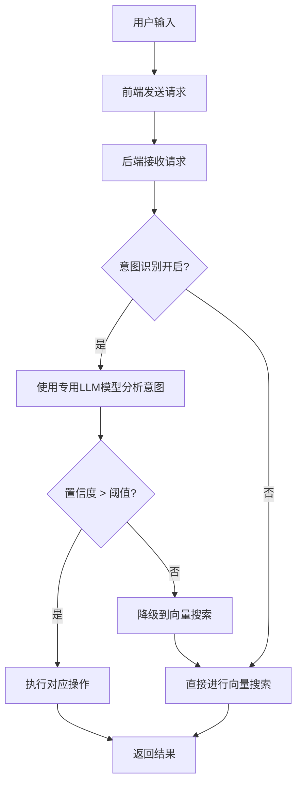

# 意图识别功能优化说明

## 📋 概述

本次优化将智能检索对话功能的意图分析完全迁移到后端处理，采用专用的LLM模型进行意图识别，并将所有配置（包括提示词）集中管理。

## 🚀 主要改进

### 1. **前端简化**
- **移除前端意图分析逻辑**：删除了 `determineSearchStrategy()` 函数
- **统一接口调用**：所有请求都通过 `/api/search/` 接口处理
- **纯传参模式**：前端只负责传递用户输入和配置参数，不做任何意图判断

### 2. **后端专用意图识别**
- **独立配置模型**：使用专门的意图识别LLM模型，默认 `deepseek:deepseek-chat`
- **可配置提示词**：提示词模板存储在配置文件中，支持环境变量自定义
- **智能降级机制**：意图分析失败时自动降级到向量搜索

### 3. **配置集中管理**

#### 新增配置项 (`config.py`)
```python
# 意图识别专用LLM配置
INTENT_ANALYSIS_LLM_PROVIDER = 'deepseek'
INTENT_ANALYSIS_LLM_MODEL = 'deepseek-chat'
ENABLE_INTENT_ANALYSIS = True

# 意图识别提示词模板配置
INTENT_ANALYSIS_SYSTEM_PROMPT = """专业的意图分析提示词..."""
INTENT_ANALYSIS_USER_PROMPT_TEMPLATE = """请分析以下用户输入的意图：

用户输入："{query}"

请返回JSON格式的分析结果："""

# 意图识别模型参数配置
INTENT_ANALYSIS_MAX_TOKENS = 300
INTENT_ANALYSIS_TEMPERATURE = 0.1
INTENT_ANALYSIS_CONFIDENCE_THRESHOLD = 0.6
```

#### 环境变量支持 (`config.env`)
```bash
# Intent Analysis LLM Settings
INTENT_ANALYSIS_LLM_PROVIDER=deepseek
INTENT_ANALYSIS_LLM_MODEL=deepseek-chat
ENABLE_INTENT_ANALYSIS=true

# Intent Analysis Model Parameters
INTENT_ANALYSIS_MAX_TOKENS=300
INTENT_ANALYSIS_TEMPERATURE=0.1
INTENT_ANALYSIS_CONFIDENCE_THRESHOLD=0.6
```

## 🔄 工作流程

### 新的意图识别流程


### 意图类型和操作
| 意图类型 | 操作类型 | 描述 | 示例 |
|---------|---------|------|------|
| `mcp_action` | `create_file` | 创建文件 | "新建readme.md文件" |
| `mcp_action` | `create_folder` | 创建文件夹 | "创建项目文档文件夹" |
| `folder_analysis` | `analyze_folder` | 分析文件夹完整性 | "分析02商请移送还缺少哪些内容" |
| `vector_search` | `search_documents` | 搜索文档内容 | "找一下租赁合同" |

## 📊 技术特点

### 1. **双重保障机制**
- **LLM意图分析**：使用专用模型进行高精度意图识别
- **智能降级**：分析失败时自动切换到向量搜索

### 2. **灵活配置**
- **模型可切换**：支持本地模型和远程模型
- **提示词可定制**：通过环境变量自定义提示词
- **参数可调整**：置信度阈值、温度参数等均可配置

### 3. **性能优化**
- **专用模型**：意图识别使用轻量级专用模型
- **参数优化**：低温度参数确保输出稳定性
- **置信度控制**：通过阈值控制意图识别精度

## 🛠️ 使用方法

### 1. **启动测试**
```bash
# 测试意图识别配置和功能
python test_intent_analysis.py
```

### 2. **自定义配置**
```bash
# 修改环境变量 (config.env)
INTENT_ANALYSIS_LLM_PROVIDER=openai
INTENT_ANALYSIS_LLM_MODEL=gpt-3.5-turbo
INTENT_ANALYSIS_CONFIDENCE_THRESHOLD=0.7

# 或直接修改代码中的配置 (config.py)
INTENT_ANALYSIS_SYSTEM_PROMPT = "您的自定义提示词..."
```

### 3. **前端调用**
```javascript
// 前端只需要传递基本参数
const requestData = {
    query: message,
    top_k: 5,
    similarity_level: selectedSimilarity,
    llm_model: llmConfig.model,
    enable_llm: llmConfig.isAvailable,
    enable_mcp: enableMCP,
    enable_intent_analysis: true  // 启用后端意图分析
};

// 统一使用语义搜索接口
const response = await fetch('/api/search/', {
    method: 'POST',
    headers: { 'Content-Type': 'application/json' },
    body: JSON.stringify(requestData)
});
```

## 📈 优势对比

| 方面 | 优化前 | 优化后 |
|------|--------|--------|
| **意图分析位置** | 前端简单判断 | 后端专用LLM |
| **分析精度** | 基于关键词匹配 | AI智能分析 |
| **配置管理** | 硬编码逻辑 | 集中配置文件 |
| **模型选择** | 通用LLM模型 | 专用意图识别模型 |
| **错误处理** | 基础处理 | 智能降级机制 |
| **扩展性** | 受限 | 高度可配置 |

## 🔧 维护指南

### 1. **调整意图识别精度**
```bash
# 提高精度（减少误判）
INTENT_ANALYSIS_CONFIDENCE_THRESHOLD=0.8

# 降低精度（增加识别率）
INTENT_ANALYSIS_CONFIDENCE_THRESHOLD=0.4
```

### 2. **优化提示词**
```python
# 在 config.py 中修改系统提示词
INTENT_ANALYSIS_SYSTEM_PROMPT = """
你是一个专业的用户意图分析助手...
[添加更具体的指导]
"""
```

### 3. **切换模型**
```bash
# 使用OpenAI模型
INTENT_ANALYSIS_LLM_PROVIDER=openai
INTENT_ANALYSIS_LLM_MODEL=gpt-3.5-turbo

# 使用本地模型
INTENT_ANALYSIS_LLM_PROVIDER=ollama
INTENT_ANALYSIS_LLM_MODEL=llama2
```

## ✅ 测试验证

运行测试脚本验证功能：
```bash
python test_intent_analysis.py
```

测试将验证：
- ✅ 配置加载正确性
- ✅ 提示词模板格式
- ✅ 各种意图识别准确性
- ✅ 置信度阈值控制
- ✅ 错误处理机制

## 📝 总结

此次优化实现了：
1. **前端职责简化**：专注于用户交互和结果展示
2. **后端智能化**：使用专用LLM进行精确意图分析
3. **配置集中化**：所有参数和提示词统一管理
4. **系统稳定性**：智能降级确保服务连续性
5. **扩展灵活性**：支持多种模型和自定义配置

这种架构设计提高了系统的智能化程度，同时保持了良好的可维护性和扩展性。 